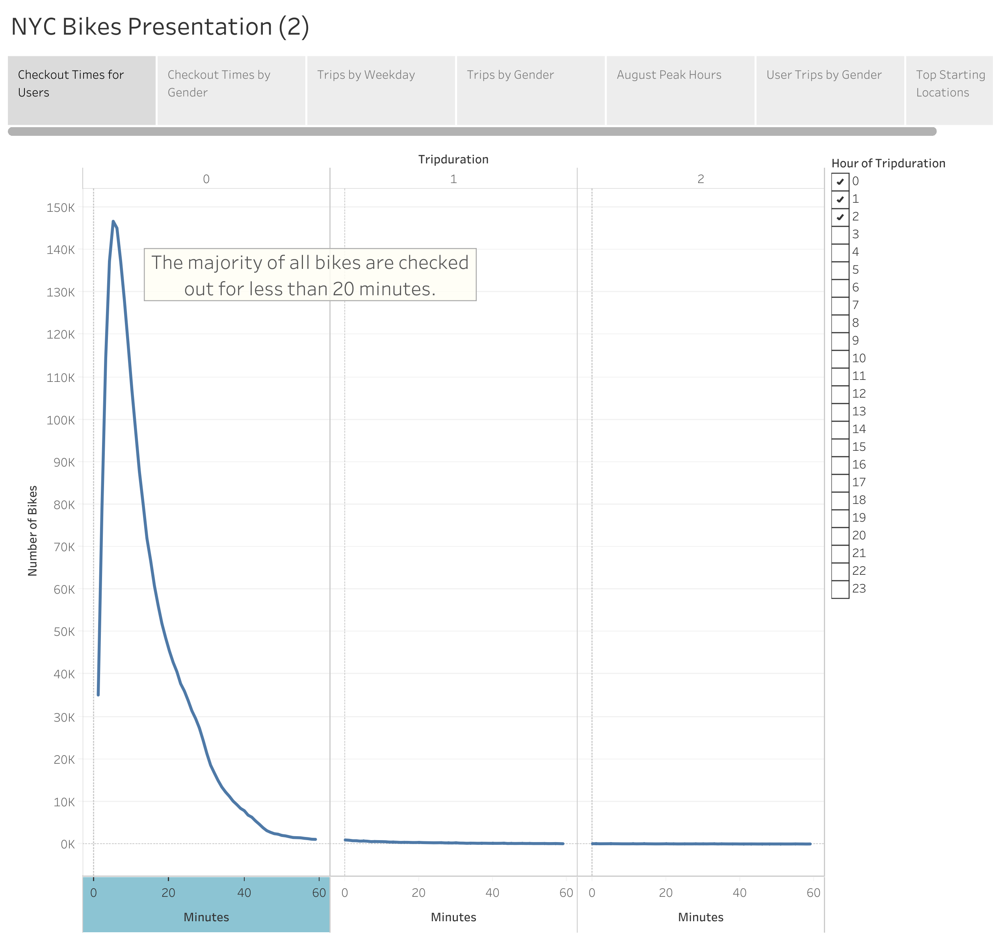
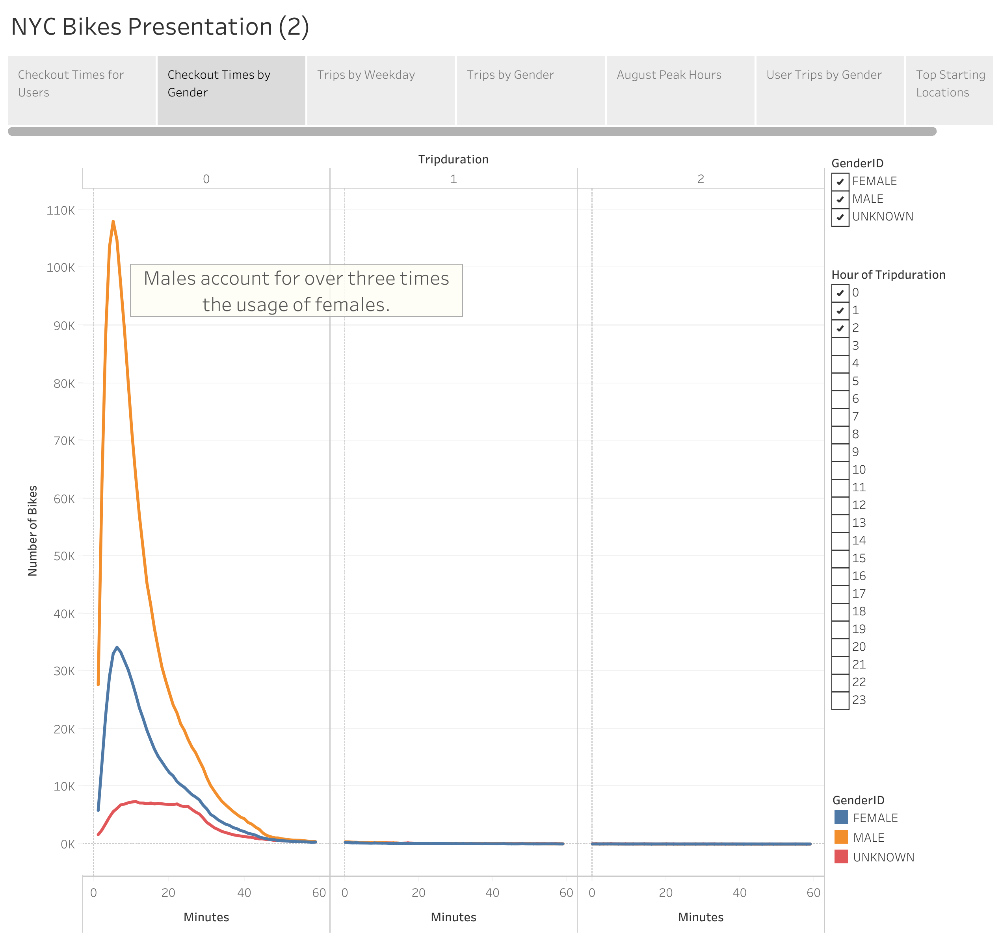
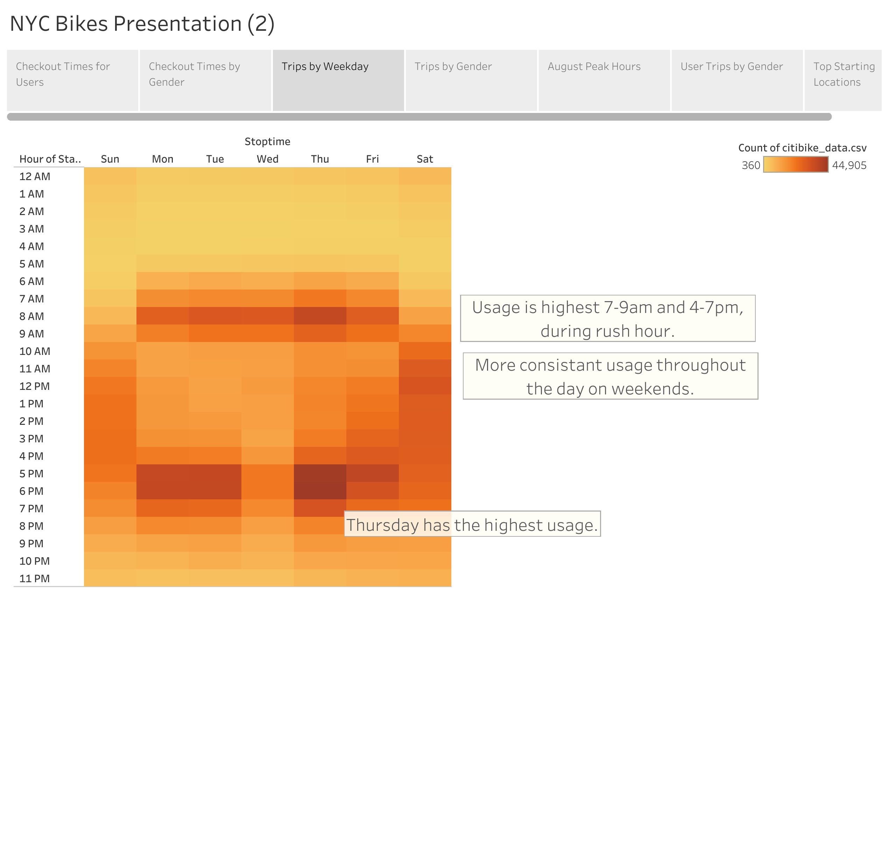
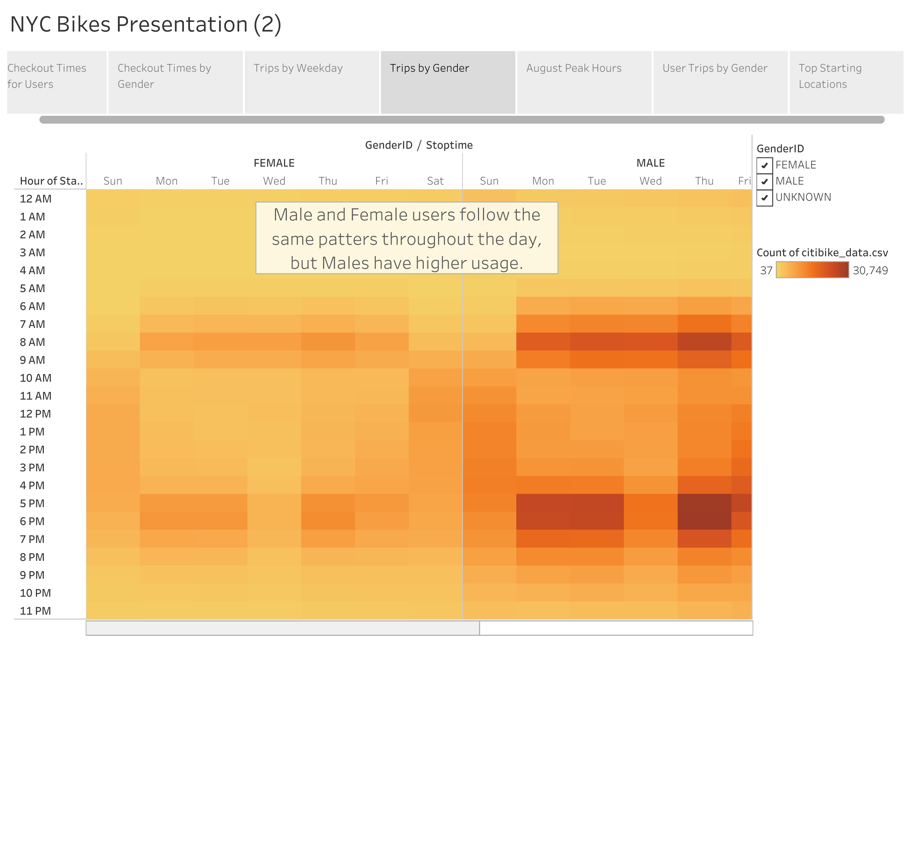
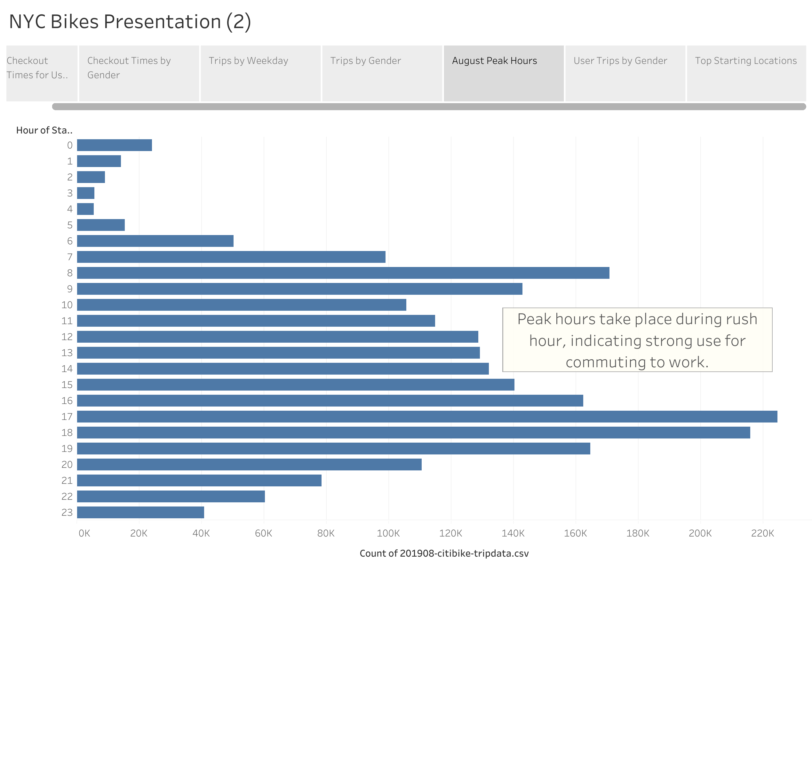

# Bike Sharing

## Overview

# Background
The client I am working with observed the success of bike sharing services in New York City, and is interested in starting a bike sharing service in Des Moines.

# Purpose
The purpose of this project was to analyze bike sharing data in New York City and use it to create a presentation to show viability of a bike sharing company in Des Moines. 

## Results

Line graph showing checkout times for all users.

Line graph showing checkout times based on gender. 

Heatmap showing bike usage throughout the week.

Heatmap showing bike usage throughout the week seperated by gender.

Presentation:

[link to dashboard](https://public.tableau.com/shared/YZPCF5498?:display_count=n&:origin=viz_share_link)

